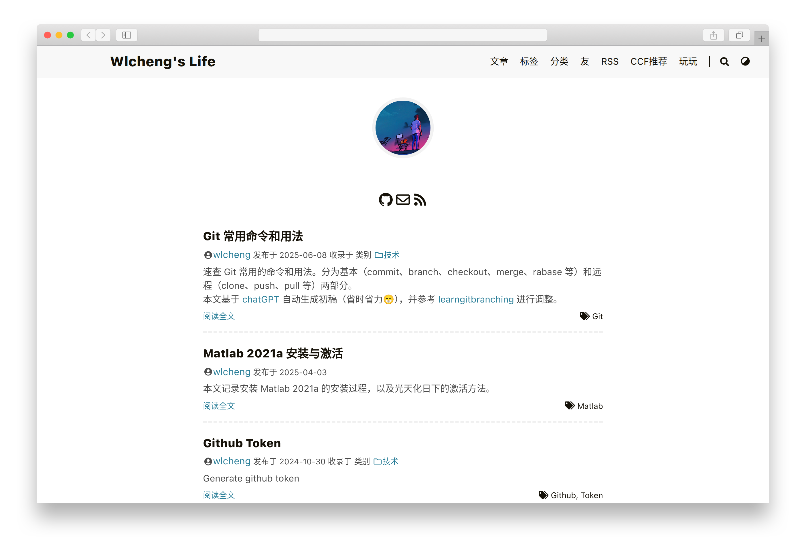

# pages-hugo-source

基于 [Hugo Extended](https://gohugo.io/getting-started/installing/#extended) 与 [DoIt](https://github.com/HEIGE-PCloud/DoIt) 主题的个人博客源码仓库，只包含构建站点所需的技术资产。

- 编译后站点源码仓库：[wlchengg/wlchengg.github.io](https://github.com/wlchengg/wlchengg.github.io)
- 博客主页：[https://wlcheng.cc/](https://wlcheng.cc/)

## 环境依赖
- [Hugo Extended 0.145.0](https://gohugo.io/getting-started/installing/#extended)（见 `.env`）
- [Node.js 18+](https://nodejs.org/)（仅在需要重新编译主题的 Tailwind 资源时使用）
- [Git](https://git-scm.com/)（用于管理主题子模块）

## 仓库结构
- `config.toml`：站点主配置，启用 `DoIt` 主题、站点多语言、菜单、短代码和各类参数。
- `archetypes/default.md`：新建内容的 Front Matter 模板。
- `content/`：Markdown 页面与文章目录（含 `posts/`、`authors/` 等）。
- `static/`：直接暴露于站点根路径的静态资源，如 `static/playing/index.html` 等自定义页面。
- `data/authors/`：DoIt 主题使用的作者资料，用于补充头像、社交信息。
- `assets/jsconfig.json`：为主题前端资源（JS/Tailwind）提供路径提示，便于定制。
- `themes/DoIt/`：Git 子模块引入的主题源码，包含 Tailwind、Algolia 等前端依赖。
- `resources/`：Hugo 构建生成的缓存资源，可删除后重新生成。
- `public/`：`hugo` 构建产出的静态站点目录，可直接部署到 Pages。

## 初次拉取与准备
1. 克隆仓库并拉取主题子模块：
   - `git clone --recursive <repository>`
   - 若已克隆则执行 `git submodule update --init --recursive`
2. （可选）进入 `themes/DoIt/` 安装前端依赖以用于本地 Tailwind 开发：`npm install`

## 本地开发
- 启动 Hugo 开发服务器（包含草稿）：`hugo server -D`
- 若需要实时编译主题样式，在 `themes/DoIt/` 目录执行 `npm run server:tailwind`
- 打开 `http://localhost:1313` 预览站点

## 构建与发布
- 生产构建命令：`hugo --minify`（生成内容位于 `public/`）
- `.github/workflows/generate-hugo-pages.yml` 使用 [peaceiris/actions-hugo](https://github.com/peaceiris/actions-hugo) 与 [peaceiris/actions-gh-pages](https://github.com/peaceiris/actions-gh-pages)：
  - 从 `.env` 读取 `HUGO_VERSION` 以确保与本地一致
  - 自动同步主题子模块
  - 使用 `HUGO_DEPLOY_TOKEN` 将 `public/` 内容部署到 `wlchengg/wlchengg.github.io` 仓库的 `main` 分支

## 其他说明
- `.hugo_build.lock` 避免并发构建冲突，可按需删除
- 根据 Hugo 官方建议，`resources/` 与 `public/` 属于生成产物，必要时可清理后重新构建
- 新增第三方服务（评论、搜索等）时，请在 `config.toml` 的对应 `params` 区域维护配置
